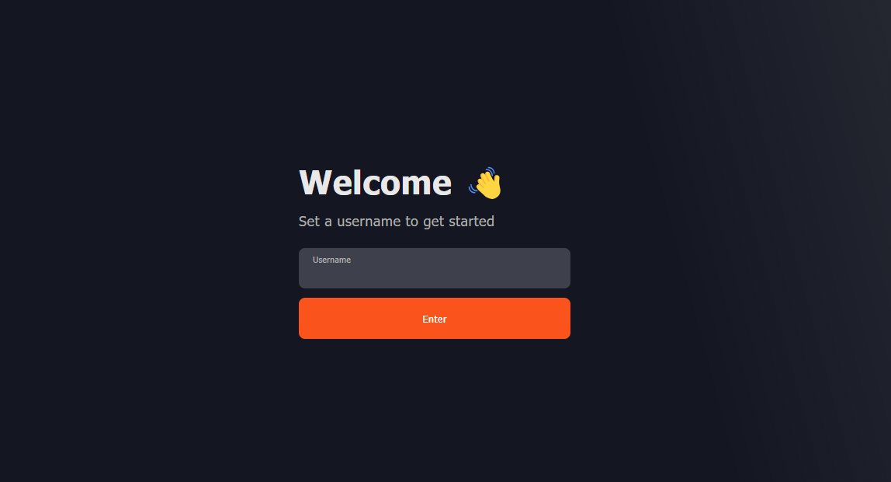
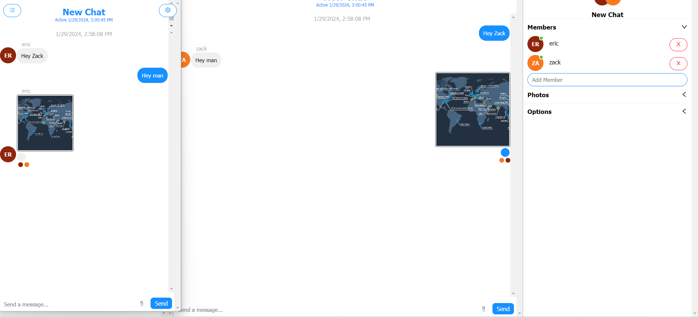

# Node.js RealTime Chat App

This project was created using Node.js, Express and React. It also implements ChatEngine.io

Users can create an account and start chats either 1on1 or in a group.

The project makes use of sockets to implement real time chat.

## Welcome Page

## Chat Page

